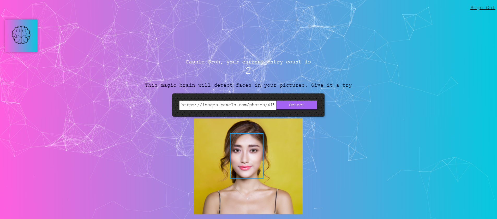

<h1 align="center">
     </br>
    Face Recognition Brain
</h1>

<p align="center">
  <a href="#-technologies">Technologies</a>&nbsp;&nbsp;&nbsp;|&nbsp;&nbsp;&nbsp;
  <a href="#-project">Project</a>&nbsp;&nbsp;&nbsp;|&nbsp;&nbsp;&nbsp;
  <a href="#-running">Running</a>&nbsp;&nbsp;&nbsp;|&nbsp;&nbsp;&nbsp;
  <a href="#memo-license">License</a>
</p>

<p align="center">
 

  

  
</p>

<p align="center">
  
</p>

## 🚀 Technologies

This project was developed with the following technologies:

- [Node.js](https://nodejs.org/en/)
- [React](https://reactjs.org)
- [Clarifai](https://www.clarifai.com/)

## 💻 Project

Face recognition brain is an app made to detect faces on given images using Clarifai API.

## 💻 Running

You can run it locally by using the following commands:

- Fork and clone this repository;
- Run ```yarn install``` on root directory;
- Run ```yarn start``` on `./packages/server` & `./packages/web`;
- Register an account and enjoy it.

## :memo: License

This project is under MIT license. See [LICENSE](LICENSE.md) for more details.

---

Made with 💙 by [Cassio Groh](https://www.linkedin.com/in/cassiogroh/) :wave:
